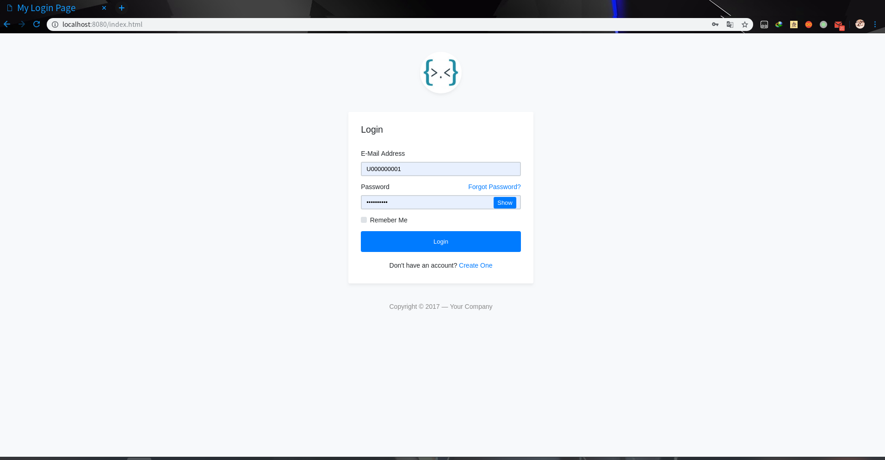

# CourseSelectingSystem

选课系统，一个基础的框架使用入门练手项目，在庞大的知识体系之下，迷茫的我决定首先学会使用，再去详细理解各种概念以及细节。

## 运行

运行该系统需要java8（或以上）+mysql的支持

```shell
git clone git@github.com:tortoiselala/CourseSelectingSystem.git
```

### mysql配置

在resources文件夹下创建mysq.properties文件并复制以下配置模板到文件：

```mysql
mysql.driver=com.mysql.jdbc.Driver
mysql.url=jdbc:mysql://localhost:3306/databasename
mysql.username=databaseusername
mysql.password=databasepassword
```

补全username和password。

## 初始化数据库

执行resources文件夹下的schema.sql来初始化数据库。

## 运行系统

```shell
cd CourseSelectingSystem

mvn jetty:run
```

在浏览器打开
```html
http://localhost:8080/index.html
```
将看到如下的登录界面：


## 技术栈

- spring mvc
- mybatis